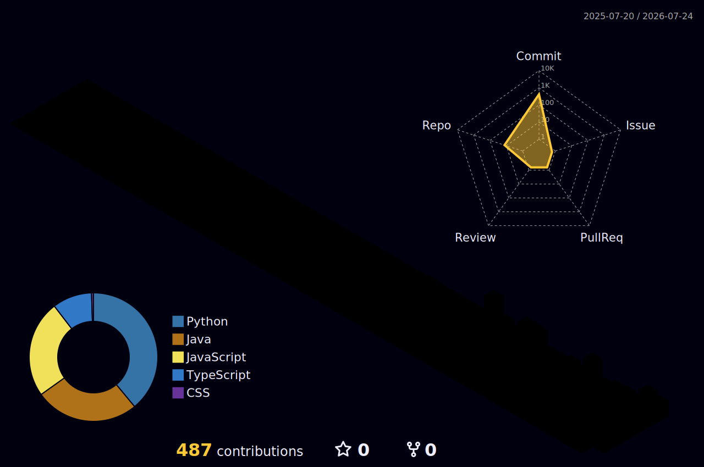

***

## > whoami

```bash
vishnu@developer:~$ cat Vishnu.py
```

```python
class Vishnu:
    def __init__(self):
        self.name = "Vishnu Vardhan Uppari"

        self.role = "Aspiring AI Engineer"

        self.currently = (
            "Learning Python, software engineering fundamentals, "
            "and building AI applications one project at a time."
        )

        self.focus = [
            "Python",
            "AI Engineering",
            "LLMs",
            "Backend Development",
            "Problem Solving"
        ]

        self.learning = [
            "FastAPI",
            "SQL",
            "Docker",
            "RAG",
            "LangChain",
            "AI Agents"
        ]

        self.roadmap = [
            "Python",
            "FastAPI",
            "SQL",
            "Git",
            "Docker",
            "LLMs",
            "RAG",
            "AI Agents",
            "Production AI"
        ]

        self.goal = (
            "Build production-ready AI applications and contribute "
            "to products that solve real-world problems."
        )

        self.belief = (
            "Consistency compounds. Learn deeply, build often, and "
            "understand every line of code."
        )

    def say_hi(self):
        print("Welcome to my GitHub! Follow my journey from beginner to AI Engineer 🚀")

me = Vishnu()
me.say_hi()
```

***

## > current_focus

- 🐍 Engineering robust backend APIs and microservices using **Python** and **FastAPI**.
- 🤖 Integrating Large Language Models (**LLMs**) and orchestrating autonomous **AI Agents**.
- 🧠 Designing Retrieval-Augmented Generation (**RAG**) workflows and optimizing **SQL** databases.

***

## > roadmap

- [x] **Python** (OOP, Design Patterns, Scripting)
- [/] **FastAPI** (Async APIs, Web Frameworks)
- [/] **SQL** (PostgreSQL, Database Design)
- [/] **Git** (Version Control, Collaborative Flows)
- [ ] **Docker** (Containerization, Deployments)
- [ ] **LLMs** (Prompting, Fine-tuning, Integrations)
- [ ] **RAG** (Vector DBs, Semantic Search)
- [ ] **AI Agents** (LangChain, CrewAI, AutoGen)
- [ ] **Production AI** (Deploying, Scaling, Monitoring)

***

## > tech_stack

**Languages**


**Backend & APIs**


**AI & Orchestration**


**Frontend & Databases**


**Tools & DevOps**


***

## > github_stats

<div align="center">
  
</div>

***

## > contribution_3d

<div align="left">
  
</div>

***

## > projects

`[01]` **Apex Excel AI** — High-performance pharmaceutical data integration & anomaly detection platform.
- **Stack**: `FastAPI` | `Google Gemini API` | `MongoDB` | `Pandas` | `GridFS`
- **Source**: [github.com/Vishnu3568/7-Apex-Excel-AI](https://github.com/Vishnu3568/7-Apex-Excel-AI-main)

`[02]` **CV Enhancer AI** — Full-stack AI-powered resume enhancement platform.
- **Stack**: `FastAPI` | `React` | `OpenAI API` | `python-docx` | `PyPDF2`
- **Source**: [github.com/Vishnu3568/CV-Enhancer-ai](https://github.com/Vishnu3568/CV-Enhancer-ai)

`[03]` **PrimeTrade Sentiment Analysis** — Data science pipeline analyzing BTC trader performance vs market sentiment.
- **Stack**: `Python` | `Jupyter` | `Pandas` | `Scikit-Learn` | `Seaborn` | `Statsmodels`
- **Source**: [github.com/Vishnu3568/primetrade-sentiment-analysis](https://github.com/Vishnu3568/primetrade-sentiment-analysis)

***

## > terminal_activity

<!-- START_ACTIVITY -->

| Timestamp | CLI Command / Activity |
| :--- | :--- |
| `[Jul 21, 2026]` | `git checkout -b main` <br> _↳ Created branch in client-intelligence-platform_ |
| `[Jul 18, 2026]` | `git checkout -b main` <br> _↳ Created branch in primetrade-sentiment-analysis_ |

<!-- END_ACTIVITY -->

***

## > connect

<p align="center">
  <i>I'm always open to collaborating on backend systems, open source contributions, or just a good tech conversation.</i>
</p>

<p align="center">
  <a href="https://www.linkedin.com/in/vishnu-vardhan-uppari-797153351/">
    
  </a>
  <a href="mailto:uvishnu3568@gmail.com">
    
  </a>
  <a href="https://discord.com">
    
  </a>
</p>

<p align="center">
  <sub>Designed with 💜 by Vishnu • Last updated 2026 • Open to opportunities</sub>
</p>
