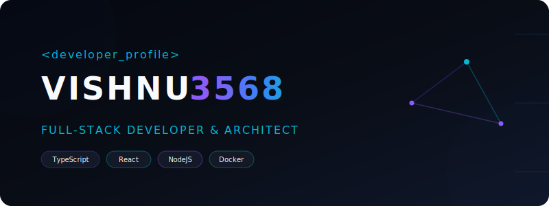

# 🌌 Welcome to My Space

  

  

## 🧑‍💻 About Me

I am a Full-Stack Engineer and Software Architect dedicated to building high-performance, modular, and scalable software systems. I specialize in designing robust backend pipelines, type-safe frontend architectures, and automated cloud workflows.

* 🛠️ Currently developing **[ExpenseIQ](https://github.com/Vishnu3568/ExpenseIQ)** - a full-stack personal finance and wealth-tracking dashboard.
* 🔭 Exploring advanced agentic workflows and container orchestrations.
* ⚡ Fun fact: I believe that code is written for humans to read and only incidentally for computers to execute.

 

  

## 📊 Performance Metrics

<table align="center" width="100%" border="0" cellspacing="0" cellpadding="0">
  <tr>
    <td width="50%" align="center">
      
    </td>
    <td width="50%" align="center">
      
    </td>
  </tr>
</table>

  

 

  

## 💻 Core Stack

| Layer | Tools &amp; Technologies |
| --- | --- |
| **Frontend &amp; UI** |   |
| **Backend &amp; APIs** |    |
| **Data &amp; Cache** |  |
| **DevOps &amp; Cloud** |   |

 

  

## 🚀 Featured Showcases

<table width="100%">
  <tr>
    <td width="50%" valign="top">
      <h3>💡 ExpenseIQ</h3>
      
A full-stack reactive finance planner and expense manager. Designed with Vite/React frontend and node/express backend.

      

        
        
        
      

      <a href="https://github.com/Vishnu3568/ExpenseIQ"><b>View Repository →</b></a>
    </td>
    <td width="50%" valign="top">
      <h3>🤖 Binance Trading Bot</h3>
      
Automated crypto trading bot executing spot orders based on indicators. Built with modular python service and dockerized.

      

        
        
      

      <a href="https://github.com/Vishnu3568/Binance-Trading-Bot"><b>View Repository →</b></a>
    </td>
  </tr>
</table>

 

  

## 📻 Broadcast Signals (Latest Activity)

<!-- ACTIVITY_START -->
- 🚀 Created new branch: [`Vishnu3568/Vishnu3568`](https://github.com/Vishnu3568/Vishnu3568)
- 📝 Pushed **1 commit(s)** to [`Vishnu3568/binance-futures-trading-bot`](https://github.com/Vishnu3568/binance-futures-trading-bot) on branch `master`
- 🚀 Created new branch: [`Vishnu3568/binance-futures-trading-bot`](https://github.com/Vishnu3568/binance-futures-trading-bot)
- 📝 Pushed **1 commit(s)** to [`Vishnu3568/ExpenseIQ`](https://github.com/Vishnu3568/ExpenseIQ) on branch `main`
- 🚀 Created new branch: [`Vishnu3568/SkillMatrix`](https://github.com/Vishnu3568/SkillMatrix)
<!-- ACTIVITY_END -->

 

  

  
  &nbsp;&nbsp;
  

