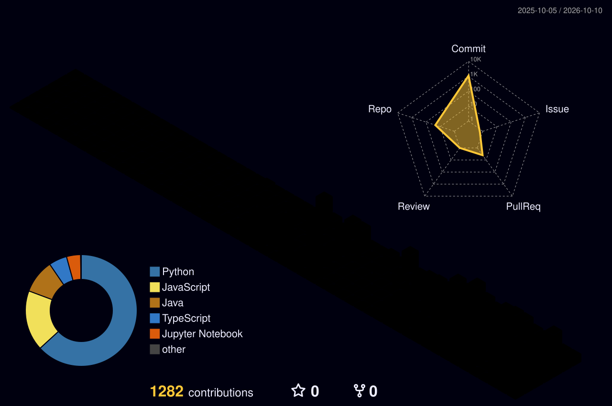
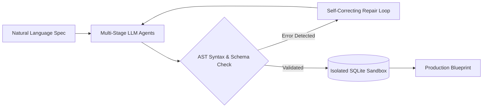

<p align="center">
  
</p>

<h1 align="center">Hi 👋, I'm Vishnu Vardhan</h1>

<p align="center">
  🚀 <b>Aspiring AI Engineer</b> • 🤖 <b>LLMs &amp; AI Agents</b> • 🐍 <b>Python &amp; FastAPI</b> • 🧠 <b>RAG &amp; Vector Databases</b>
</p>

***

## > whoami

```bash
vishnu@developer:~$ cat Vishnu.py
```

```python
class Vishnu:
    def __init__(self):
        self.name = "Vishnu Vardhan Uppari"
        self.role = "AI Engineer & Backend Developer"

        self.currently = (
            "Architecting autonomous AI agent pipelines, production RAG systems, "
            "and robust FastAPI backend services."
        )

        self.telemetry = {
            "runtimes": ["Gemini 1.5/2.0 Pro", "OpenAI GPT-4o"],
            "vector_engines": ["pgvector", "ChromaDB"],
            "agent_frameworks": ["LangGraph", "LangChain", "Autonomous Workflows"],
            "backend_core": ["FastAPI", "Async Python", "MongoDB / PostgreSQL"]
        }

        self.focus = [
            "AI Engineering",
            "Autonomous Agents",
            "RAG Architectures",
            "High-Throughput APIs",
            "Distributed Systems"
        ]

        self.goal = (
            "Build production-grade, self-healing AI applications and contribute "
            "to resilient systems that solve complex real-world challenges."
        )

        self.belief = (
            "Consistency compounds. Learn deeply, build often, and "
            "understand every line of code."
        )

    def say_hi(self):
        print("Welcome to my GitHub! Engineering production-grade AI systems and autonomous agents 🚀")

me = Vishnu()
me.say_hi()
```

***

## > current_focus

- 🐍 Engineering robust backend APIs and microservices using **Python** and **FastAPI**.
- 🤖 Integrating Large Language Models (**LLMs**) and orchestrating autonomous **AI Agents**.
- 🧠 Designing Retrieval-Augmented Generation (**RAG**) workflows and optimizing **SQL** databases.

***

## > roadmap

- [x] **Python** (OOP, Design Patterns, Scripting)
- [x] **FastAPI** (Async APIs, Dependency Injection, Microservices)
- [x] **SQL & pgvector** (PostgreSQL, Vector Embeddings, Schema Design)
- [x] **Git & CI/CD** (GitHub Actions, Automation Pipelines)
- [x] **LLMs & Prompt Engineering** (Gemini 1.5/2.0, OpenAI, Structured Outputs)
- [x] **RAG Systems** (Vector Search, Hybrid Retrieval, GridFS)
- [x] **AI Agents** (Multi-stage Pipelines, Tool Calling, AST Sandboxes)
- [ ] **Production Scaling** (Docker Orchestration, Kubernetes, LangSmith Observability)

***

## > tech_stack

**Languages & Fundamentals**


**AI Engineering & Orchestration**


**Backend & APIs**


**Databases & Storage**


**DevOps & Engineering Tools**


<br />

<div align="center">
  
</div>

***

## > github_stats

<div align="center">
  
</div>

<p align="center">
  
  &nbsp;
  
</p>

***

## > contribution_3d

<div align="left">
  
</div>

***

## > projects

`[01]` **Apex Excel AI** — High-performance pharmaceutical data integration & irregularity detection platform automating schema unification and anomaly detection.
- **Architecture**: Automated Schema Normalization $\rightarrow$ Gemini Multimodal LLM Extraction $\rightarrow$ GridFS / MongoDB Document Store $\rightarrow$ Real-time Anomaly Reports.
- **Performance**: Zero-shot multimodal extraction with schema anomaly classification across heterogeneous datasets.
- **Stack**: `FastAPI` | `Google Gemini API` | `MongoDB` | `Pandas` | `GridFS`
- **Source**: [github.com/Vishnu3568/elevance-skills-genai-internship](https://github.com/Vishnu3568/elevance-skills-genai-internship)

`[02]` **ForgeFlow AI** — Compiler-driven application generator transforming natural language into validated, executable software blueprints with automated schema repair and sandbox validation.


```mermaid
graph LR
  A[Natural Language Spec] --> B[Multi-Stage LLM Agents]
  B --> C{AST Syntax & Schema Check}
  C -- Error Detected --> D[Self-Correcting Repair Loop]
  D --> B
  C -- Validated --> E[(Isolated SQLite Sandbox)]
  E --> F[Production Blueprint]
```

- **Performance**: Sub-100ms AST schema validation in sandboxed SQLite execution with automated self-correction.
- **Stack**: `FastAPI` | `LLM Agents` | `TypeScript` | `SQLite Sandbox` | `Pydantic`
- **Source**: [github.com/Vishnu3568/Compiler-Driven-Application-Generator](https://github.com/Vishnu3568/Compiler-Driven-Application-Generator)

`[03]` **CV Enhancer AI** — Full-stack AI-powered resume parsing and content enhancement platform with template generation.
- **Architecture**: Document Stream Extraction (`docx`/`pdf`) $\rightarrow$ Contextual Prompt Engineering $\rightarrow$ Structured Output Formatting $\rightarrow$ Downloadable Artifacts.
- **Performance**: Structured Pydantic extraction ensuring 100% schema compliance for LaTeX & Markdown resume generation.
- **Stack**: `FastAPI` | `React` | `OpenAI API` | `python-docx` | `PyPDF2`
- **Source**: [github.com/Vishnu3568/CV-Enhancer-ai](https://github.com/Vishnu3568/CV-Enhancer-ai)

`[04]` **PrimeTrade Sentiment Analysis** — Quantitative data science pipeline analyzing Bitcoin trader performance vs. Fear & Greed sentiment regimes.
- **Architecture**: Time-series Regimes $\rightarrow$ Behavioral Distribution Clustering $\rightarrow$ Statistical Hypothesis Testing $\rightarrow$ Predictive Modeling.
- **Performance**: Statistically significant alpha identification across extreme market fear/greed volatility regimes.
- **Stack**: `Python` | `Scikit-Learn` | `Pandas` | `Seaborn` | `Statsmodels`
- **Source**: [github.com/Vishnu3568/primetrade-sentiment-analysis](https://github.com/Vishnu3568/primetrade-sentiment-analysis)

***


## > contribution_snake

### 🐍 THE DARK MARK... WAIT, NO — THE CONTRIBUTION BASILISK


<picture>
  <source media="(prefers-color-scheme: dark)" srcset="assets/github-contribution-grid-snake-dark.svg" />
  <source media="(prefers-color-scheme: light)" srcset="assets/github-contribution-grid-snake.svg" />
  
</picture>

<p align="center">
  🐍 <i>"Not Slytherin, not Slytherin..." — The Sorting Hat</i><br />
  🦁 <i>"GRYFFINDOR!" — And so it was decided</i>
</p>

***

## > connect

<p align="center">
  <i>I'm always open to collaborating on backend systems, open source contributions, or just a good tech conversation.</i>
</p>

<p align="center">
  <a href="https://www.linkedin.com/in/vishnu-vardhan-uppari-797153351/">
    
  </a>
  <a href="mailto:uvishnu3568@gmail.com">
    
  </a>
  <a href="https://discord.com">
    
  </a>
</p>
<p align="center">
  
</p>
<p align="center">
  <sub>Designed with 💜 by Vishnu • Last updated 2026 • Open to opportunities</sub>
</p>
